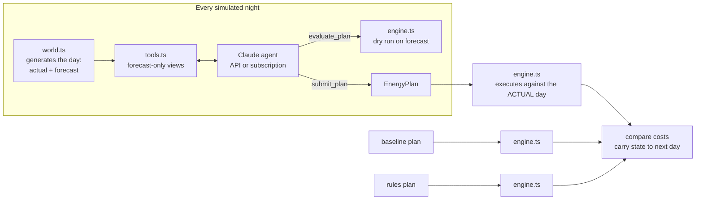

# Warehouse Power Economy: an AI energy-manager agent (tutorial)

This tutorial builds an AI agent that manages a **simulated warehouse energy system**. It is inspired by Matthew Purcell's *PowerPlay* home-energy agent ([article](agent-economy.md)): every night the agent reads the state of the site and its forecasts, reasons about risk, and commits a plan for tomorrow. A nightly **counterfactual** measures what the day would have cost without the agent.

The agent has tools for:

| Tool | What it returns |
|---|---|
| `get_battery_status` | SoC, capacity, power limits, efficiency |
| `get_solar_forecast` | Hourly P10 / P50 / P90 kW for the 400 kWp array |
| `get_weather_forecast` | Hourly temperature (which drives heating load), cloud, rain |
| `get_electricity_prices` | Time-of-use tariff, export price, network-peak events, demand charge |
| `get_workload_forecast` | Orders/hour, shifts, forecast site load, fleet energy use |
| `get_fleet_status` | 12 forklifts on two shifts + 3 delivery vans: SoC, chargers, departure deadlines |
| `get_operational_constraints` | Grid limit, battery reserve, no-charge windows, penalties, stored-energy value |
| `get_recent_history` | Last 7 days: forecast vs actual, agent cost vs no-agent cost |
| `evaluate_plan` | **What-if simulator**: dry-runs a candidate plan against the forecast |
| `submit_plan` | Commits tomorrow's battery schedule and fleet-charging plan |

## Quick start

```bash
npm install

# No LLM: compare the "no agent" baseline with a hand-written rules policy
npm run sim -- --days 14 --backend none

# Run the agent on your Claude subscription (Pro/Max). Sign in to the `claude` CLI first.
npm run sim -- --days 7 --backend subscription

# Or run it on the Anthropic API (pay per token)
export ANTHROPIC_API_KEY=sk-ant-...
npm run sim -- --days 7 --backend api
```

Options:

| Flag | Default | Meaning |
|---|---|---|
| `--days` | `7` | Days to simulate |
| `--seed` | `42` | Scenario seed; the same seed gives the same weather, workload and prices |
| `--start` | `2026-06-01` | First date (a Southern Hemisphere winter) |
| `--backend` | `subscription` | `subscription` (Claude Agent SDK), `api` (Anthropic SDK), or `none` |
| `--model` | `claude-opus-5-5` | e.g. `claude-sonnet-5-5` or `claude-haiku-4-5`, to see how cost changes |
| `--effort` | `medium` | `low` … `max`: how much the model thinks |
| `--quiet` | off | Hide per-tool-call output |

Each run writes a decision log to `runs/<timestamp>/`. There is one JSON file per day, holding the scenario, every tool call, the agent's reasoning and summary, the plan, and the results for the agent, the baseline and the rules policy. `summary.json` holds the totals.

Example output (seed 42, first 3 days, Opus 5.5, subscription):

```
Baseline (no agent): $2253.13
Rules (if-then):     $2005.09   saved $248.04
Agent:               $1272.76   saved $980.37 (43.5%)
LLM cost:            $0.89 (API-equivalent estimate; covered by your subscription)
```

## How it works



### 1. The world (`src/sim/world.ts`)

The site is **Northgate Distribution Centre**:

- **Solar:** 400 kWp. Winter output, shaped by cloud cover.
- **Battery:** 500 kWh, 200 kW. A 20% reserve is kept for cold-room ride-through.
- **Grid:** 350 kW import limit, 150 kW export limit.
- **Load:** refrigeration and IT base load, conveyors that scale with orders, and heating that scales with cold weather.
- **Fleet:** shift-A forklifts work 06–14 and shift-B forklifts work 14–22, each needing 85% at the start of their shift. Vans run routes 07–17 and need 90%. All vehicles share an 80 kW charger bank.
- **Tariff:**

  | Band | Hours | $/kWh |
  |---|---|---|
  | Off-peak | 00–06 | 0.09 |
  | Shoulder | 06–10, 21–24 | 0.24 |
  | Solar-soak | 10–15 | 0.16 |
  | Peak | 15–21 | 0.46 |

  There are also random **network-peak events** ($1.20/kWh import, $0.80/kWh export credit) and a **demand charge** of $0.45 per kW of the day's highest hourly import.

Weather follows a Markov chain, so storms come in spells. The **forecast is noisy**: about 15% of days are badly mis-forecast. The agent only ever sees the forecast.

### 2. The engine (`src/sim/engine.ts`)

The engine is one function, `runDay(state, plan, conditions)`. It steps through 24 hours:

1. Check fleet departures, and apply penalties if a vehicle is under-charged.
2. Charge vehicles according to the plan. A **failsafe** force-charges any vehicle that would otherwise miss its deadline, at whatever the price is at that hour.
3. Dispatch the battery (`self_consume`, `grid_charge`, `hold`, or `discharge`), respecting the reserve and the peak-hour grid-charging ban.
4. Enforce the import cap and the connection limit, curtail export, and price the hour.

At the end of the day, stored energy (battery plus vehicles) is valued at the off-peak refill price. Without that, a one-day planner "saves money" by leaving every forklift flat for tomorrow. The first version of this tutorial's agent did exactly that.

The agent's `evaluate_plan` tool calls the same `runDay`, fed with the forecast instead of the actual day. The agent tests plans against the same rules it's scored by.

### 3. The tools (`src/agent/tools.ts`)

Each tool is defined once as `{ name, description, shape (Zod), handler }`, and each backend adapts that list to its own tool format. The plan schema uses time blocks (`{start_hour, end_hour, mode, power_kw}`) instead of 24 separate entries, which keeps the model's output short and hard to get wrong.

### 4. Two ways to run Claude (`src/agent/backends/`)

| | `api.ts` | `subscription.ts` |
|---|---|---|
| SDK | `@anthropic-ai/sdk` (tool runner) | `@anthropic-ai/claude-agent-sdk` |
| Auth | `ANTHROPIC_API_KEY` | Your Claude subscription (the `claude` CLI login) |
| Tools | `betaZodTool(...)` | In-process MCP server: `createSdkMcpServer` + `tool(...)` |
| Loop | SDK tool runner | Claude Code agent loop, built-in tools disabled (`tools: []`) |
| Cost | Pay per token, reported exactly | Included in your plan; the reported $ is an API-equivalent estimate |
| Extras | Prompt caching (`cache_control`), server-side refusal fallback | |

The subscription backend removes `ANTHROPIC_API_KEY` from the child process environment, so it always uses your subscription login and never silently bills an API key.

### 5. The prompt (`src/agent/prompt.ts`)

The system prompt never changes, which lets prompt caching reuse it across tool-loop iterations. The prompt tells the agent to gather data first, weigh the pessimistic (P10) case, test candidate plans with `evaluate_plan`, and then call `submit_plan` once.

### 6. The counterfactual (`src/run.ts`)

Three strategies run side by side on the same actual days, and each **carries its own state** forward from day to day, like the continuous re-simulation in the article:

- **baseline:** no agent. The battery self-consumes and vehicles charge as soon as they're plugged in.
- **rules:** a fixed policy. It grid-charges the battery at full power every night and charges vehicles only in cheap bands. It saves money, but it wastes solar headroom on sunny days and sets a large demand peak every night.
- **agent:** Claude's plan. If the agent errors or never submits a plan, the rules plan runs instead, so the site is never left without a plan.

## Exercises

These are the next steps from the article, applied to this simulator:

1. **Make it cost-effective.** Run the same seed with `--model claude-sonnet-5-5` and `--model claude-haiku-4-5`, and compare savings against LLM cost. Then try `--effort low`.
2. **Skip easy days.** Before calling the agent, check whether the forecast is confidently sunny with no price events. If it is, use the rules plan and spend nothing on the LLM.
3. **Add more planning cycles.** Add a 03:00 mid-cycle check that can revise the plan with an updated forecast. Give the forecast less noise the closer it is to the hour.
4. **Add a perfect-foresight benchmark.** Write an optimiser, such as an LP or a greedy search, that sees the actual day. This gives you the "theoretical maximum", so you can report what share of it the agent captures.
5. **Add real data.** Replace `generateDay` with real solar forecasts, a wholesale-price feed and your WMS workload data. The tools and the agent don't need to change.

## Project layout

```
src/
  run.ts                    CLI: simulate N days, compare strategies, write logs
  sim/
    types.ts                Shared types
    world.ts                Site config, tariff, fleet, weather/workload generator
    engine.ts               Hour-by-hour executor (physics, rules, failsafes, billing)
    strategies.ts           Baseline and rule-based plans
    random.ts               Seeded RNG helpers
  agent/
    prompt.ts               System prompt
    tools.ts                Tool definitions shared by both backends
    backends/api.ts         Anthropic API tool runner
    backends/subscription.ts Claude Agent SDK (subscription auth)
```
